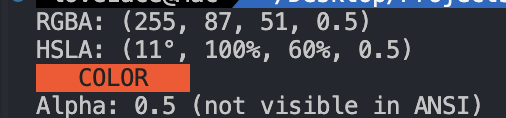

# rgba-to-hsla-cli

**rgba-to-hsla-cli** is a CLI tool that converts rgba to hsla.


## Quick Start

Get **rgba-to-hsla-cli** up and running quickly!

1. **Run**:
    ```bash
    npx rgba-to-hsla-cli 255 129 110
    ```
    or with alpha value:
    ```bash
    npx rgba-to-hsla-cli 255 129 110 0.5
    ```
2. **Done!**

### Example Output

This will convert the RGBA values `(255, 129, 110, 1)` to its HSLA equivalent, and display a color preview in your terminal.

- **Input**: `255 129 110 1`
- **Output**: `HSLA: (14°, 100%, 60%, 1)`
- **Color Preview**: `COLOR PREVIEW (in the specified color)`
- **Alpha Info**: `Alpha: 1 (not visible in ANSI)`



## Contributing

We welcome contributions to **rgba-to-hsla-cli**! Whether it's reporting a bug, suggesting an enhancement, or submitting a pull request, your input is valued.

## License

This project is licensed under the MIT License - see the [LICENSE](LICENSE) file for details.

## Contact

For any questions, suggestions, or feedback, please contact [love1ace](mailto:lovelacedud@gmail.com).